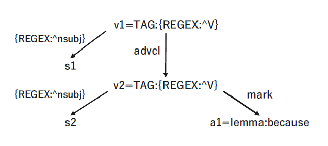
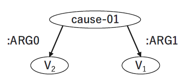

# Dependency Matching Pipeline: Complex Sentence to Skeletal AMR
Codes for the dependency matching pipeline presented in our \*SEM 2021 paper. This pipeline converts a complex sentence into its skeletal structure in AMR format, which may be useful in resolving semantic ambiguities of clausal relations in AMR parsing.

Citation:
- Yuki Yamamoto, Yuji Matsumoto, and Taro Watanabe. Dependency Patterns of Complex Sentences and Semantic Disambiguation for Abstract Meaning Representation Parsing. In Proceedings of the \*SEM 2021: The Tenth Joint Conference on Lexical and Computational Semantics.
```bib
@inproceedings{yamamoto-etal-2021-skel-amr,
  title     = {Dependency Patterns of Complex Sentences and Semantic Disambiguation for Abstract Meaning Representation Parsing},
  author    = {Yuki Yamamoto, Yuji Matsumoto, Taro Watanabe},
  booktitle = {Proceedings of *SEM 2021: The Tenth Joint Conference on Lexical and Computational Semantics},
  year      = {2021},
  url       = {https://aclanthology.org/2021.starsem-1.20},
  pages     = {212–221}
}
```

Table of Contents
=================

<!--ts-->
   * [Description](#description)
      * [Dependency Matcher](#dependency-matcher)
      * [Relation Classifier](#relation-classifier)
   * [Demo](#demo)
   * [Usage](#usage)
      * [Setup](#setup)
      * [Run Dependency Matching System](#run-dependency-matching-system)
      * [For Reproduction](#for-reproduction)
<!--te-->

# Description
Our dependency matching system is a pipeline of "Dependency Matcher" and "Relation Classifier". The pipeline first preprocesses an input sentence with lexical and syntactic processing using [`spaCy`](https://spacy.io/) and [`Stanza`](https://stanfordnlp.github.io/stanza/).

## Dependency Matcher

- The matcher is built upon dependency matching module of `spaCy`, which works in naïve manner.
- Dependency Patterns are described with corresponding Skeletal AMRs: e.g.

<p align="center">


</p>

```
# ::id 1.5.1
# ::const because
# ::pat
[{"SPEC":{"NODE_NAME":"v1"},"PATTERN":{"TAG": {"REGEX": "^V"}}},
{"SPEC":{"NODE_NAME":"s1","NBOR_RELOP":">","NBOR_NAME":"v1"},"PATTERN":{"DEP": {"REGEX": "^nsubj"}}},
{"SPEC":{"NODE_NAME":"v2","NBOR_RELOP":">","NBOR_NAME":"v1"},"PATTERN":{"TAG": {"REGEX": "^V"},"DEP":"advcl"}},
{"SPEC":{"NODE_NAME":"s2","NBOR_RELOP":">","NBOR_NAME":"v2"},"PATTERN":{"DEP": {"REGEX": "^nsubj"}}},
{"SPEC":{"NODE_NAME":"a1","NBOR_RELOP":">","NBOR_NAME":"v2"},"PATTERN":{"lemma":"because","DEP":"mark"}}]
# ::snt
# ::amr
(c / cause-01
    :ARG0 (v2 / V2)
    :ARG1 (v1 / V1))
```

- The patterns in our current version are described in spaCy v2.0 format and we are now working on to support v3.0's SEMGREX format.

## Relation Classifier
Used for semantic disambiguation of Skeletal AMRs.
In the pattern dictionary, Skeletal AMR of a subordinator "as" is described as:
```
(v1 / V1
    :cause|time (v2 / V2))
```
`:cause|time` means that "as" is ambiguous between CAUSAL and TEMPORAL relations. For semantic disambiguation, the classifier takes a pair of clauses (i.e. matrix and subordinate) as input to identify the correct coherence relation between them. 
```
subordinator: as
subordinate clause: the boy seemed reliable
matrix clause: the girl believed him
```
> As the boy seemed reliable, the girl believed him.

The classification models are trained under 4-class settings (CAUSAL, CONDITIONAL, CONCESSIVE, TEMPORAL). While "Vanilla Softmax" compares probability of all 4 classes, we add restriction rules on softmax ("Restricted Softmax") to only compare relative classes (e.g. for "as", it is a binary classification between CAUSAL and TEMPORAL). We take the restriction method by default.

Macro and micro F1 scores of the models with different approaches:

| Vanilla Softmax | *F<sub>M</sub>* | *F<sub>m</sub>* | Restricted Softmax | *F<sub>M</sub>* | *F<sub>m</sub>* |ep, l_r, b_s|
|:---|:---:|:---:|:---|:---:|:---:|---:|
|BERT→AMR |64.06 |74.29 |BERT→AMR+*r* |67.11 |77.18 |10,5e-05,16|
|BERT→WIKI |47.67 |61.72 |\-|\-|\-|3,2e-05,64|
|BERT→MIX<sub>8k</sub> |67.12 |77.50 |BERT→MIX<sub>8k</sub>+*r* |70.76 |80.52 |10,5e-05,16|
|**BERT→WIKI→AMR** |**72.43** |**81.22** |**BERT→WIKI→AMR+*r*** |**75.65** |**83.94** |10,3e-05,32|

All results are achieved using 5-fold cross validation on `AMR` data. Variances are omitted.

# Demo
```
Sentence: As the boy seemed reliable, the girl believed him.
-------------------
Dependency Parsing Input
-------------------
0 As as SCONJ IN 3 mark seemed
1 the the DET DT 2 det boy
2 boy boy NOUN NN 3 nsubj seemed
3 seemed seem VERB VBD 8 advcl believed
4 reliable reliable ADJ JJ 3 xcomp seemed
5 , , PUNCT , 8 punct believed
6 the the DET DT 7 det girl
7 girl girl NOUN NN 8 nsubj believed
8 believed believe VERB VBD 8 root believed
9 him he PRON PRP 8 obj believed
10 . . PUNCT . 8 punct believed
-------------------
Checking Copular Patterns
-------------------
Matched Pattern_ID: []
Matched Patterns: []
-------------------
Checking Complex Patterns
-------------------
Matched Words: ['As', 'seemed', 'believed']
Matched Pattern_ID: ['3']
Matched Patterns: ['V1 as V2']
-------------------
Disambiguating
-------------------
Relation: 'CAUSE'
-------------------
Output Skeletal AMR
-------------------
(c / cause-01
    :ARG0 (v2 / V2)
    :ARG1 (v1 / V1))
```

# Usage
The code has been tested on ...
- python 3.7.7
- pytorch 1.6.0
- spacy 2.3.2
- stanza 1.0.1

All dependencies are listed in requirements.txt.

## Setup

Via conda:
```sh
# Clone repository
git clone https://github.com/yama-yuki/skeletal-amr.git
# Create conda environment
conda create -n skele python=3.7
# Activate conda environment
conda activate skele
# Install all dependencies
pip install -r requirements.txt
```

Download the best performing model: 

- [BERT→WIKI→AMR](https://drive.google.com/file/d/1F1H8OSACNWEVXDhF2LmIzEz12lh6FlXD/view?usp=sharing)

## Run Dependency Matching System

0. Run:
```sh
$ python scripts/pipeline.py -m {model} -f {input_file}
```
`-m`: model path for "Relation Classifier"

`-f`: file path for input sentences

## For Reproduction
1. Training:
```sh
$ python classifier/main.py --mode train --data {data} -e {epochs} -l {learning_rate} -b {batch_size}
```

`--data`: train data for finetuning the model (`AMR`, `WIKI`, `MIX`)

`-e`: epochs (`3`, `5`, `10`)

`-l`: initial learning rate (`2e-05`, `3e-05`, `5e-05`)

`-b`: batch size (`16`, `32`, `64`)

(OPTIONAL)

`--target`: specify a pre-finetuned model for post-finetuning approach (e.g. `BERT-WIKI/3_2e-05_64`)

`-f`: for training a model on a full data (not cv splits)

```sh
# BERT→AMR
python classifier/main.py --mode train --data amr -e 10 -l 5e-05 -b 16
# BERT→WIKI→AMR
python classifier/main.py --mode train --data amr --target BERT-WIKI/3_2e-05_64/0 -e 10 -l 3e-05 -b 32
```

2. Evaluation:
```sh
$ python classifier/main.py -t {trained_model}
```
`-t`: model to evaluate (e.g. `WIKI-AMR/WIKI_3_3e-05_64_AMR_10_3e-05_32`)
